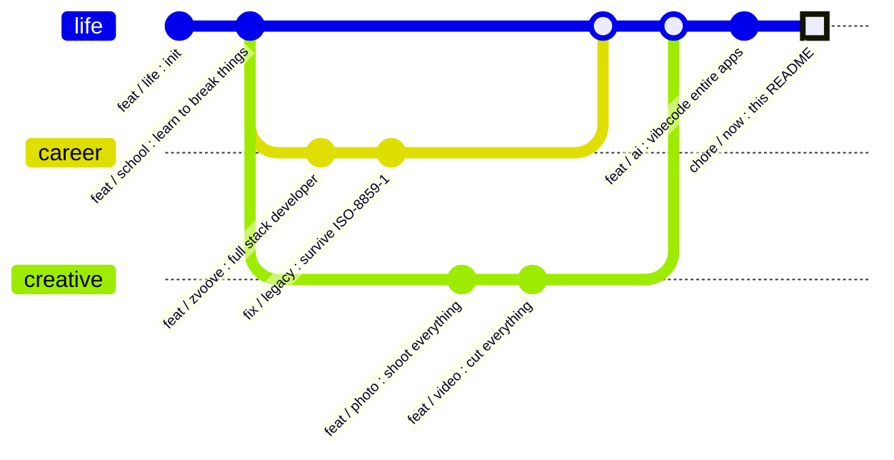

  

&nbsp;

 

> [!WARNING]
> This profile uses trailing commas,

 

---

## Tech Stack

  

 

---

## Projects

| &nbsp; | Project | Description | Stack |
|:---:|---|---|---|
| 🎨 | [**manuelheller.dev**](https://manuelheller.dev) | Creative portfolio — WebGL fluid simulation, Risograph aesthetics, GLSL shaders | Next.js · Three.js · GSAP |
| 🎯 | [**joggediballa.ch**](https://joggediballa.ch) | Full-stack club platform — events, members & Beam Mode | React · tRPC · Drizzle · MySQL |
| 🥃 | [**shot-counter**](https://github.com/manu-brighter/shot-counter) | Multi-team party scoreboard — live SSE sync, QR join by phone, bilingual, desktop app for Windows & Linux | Vue 3 · Express 5 · SQLite · Electron |
| 🤖 | [**full-project-rework**](https://github.com/manu-brighter/full-project-rework) | Claude Code skill — autonomous multi-agent codebase overhaul | Claude Code · Multi-Agent |

🥃 needs zero dev setup — grab the installer and count responsibly:&nbsp;

 

---

## Life, versioned

Some people write bios. I keep a changelog.

 

---

## GitHub Stats

  

 

---

## Contributions

> [!TIP]
> The snake below eats one commit every 12 hours. Nobody has the heart to tell it the graph grows back.

<picture>
  <source media="(prefers-color-scheme: dark)" srcset="https://raw.githubusercontent.com/manu-brighter/manu-brighter/output/github-snake-dark.svg" />
  <source media="(prefers-color-scheme: light)" srcset="https://raw.githubusercontent.com/manu-brighter/manu-brighter/output/github-snake.svg" />
  
</picture>

 

<b>🍫 Swiss confidential — do not open</b>

 

You opened it. Bold move. Since you're here — the official **Swiss Developer Emergency Kit**:

| Item | Purpose |
|---|---|
| 🍫 Chocolate | Morale, applied hourly |
| 🔪 Swiss Army knife | Dependency management for the physical world |
| 🕰️ Punctuality | Deploys happen at 09:00. Sharp. |
| 🧀 Cheese | The holes are where my semicolons went |

And because you scrolled all the way down, you get the render nobody else sees — my contributions in **Minecraft mode**:

↑ ↑ ↓ ↓ ← → ← → B A — unlocks nothing here. I just respect that you tried.

