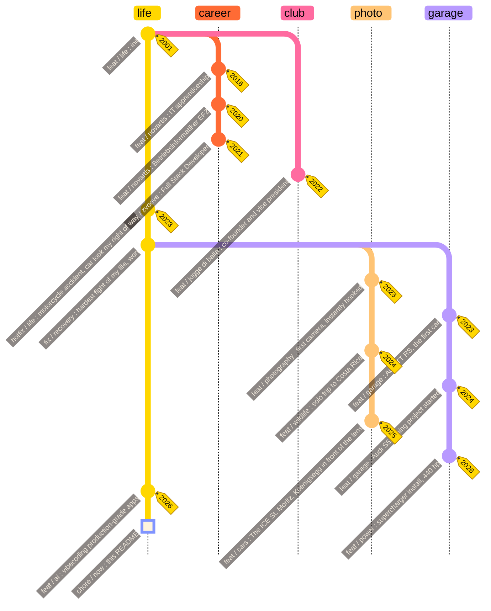

  

&nbsp;
&nbsp;

 

> [!WARNING]
> This profile uses trailing commas,

 

---

## Tech Stack

<b>DAILY&nbsp;DRIVER</b>

 

  

<b>VIBECODED&nbsp;(AI-ASSISTED)</b>

  

<b>CREATIVE</b>

&nbsp;&nbsp;&nbsp;

  

<b>AI&nbsp;WORKFLOW</b>

&nbsp;

 

---

## Projects

| &nbsp; | Project | Description | Stack |
|:---:|---|---|---|
| 🎨 | [**manuelheller.dev**](https://manuelheller.dev) | Creative developer portfolio: WebGL fluid simulation, Risograph aesthetics, GLSL shaders | Next.js · Three.js · GSAP |
| 📷 | [**photography**](https://manuelheller.myportfolio.com) | Wildlife, cars and events: Costa Rica, Thailand, The ICE St. Moritz | Lightroom · Photoshop |
| 🎯 | [**joggediballa.ch**](https://joggediballa.ch) | Club platform: events, members, permissions, sponsors, live Twitch overlay | React · tRPC · Drizzle · MySQL |
| 🥃 | [**shot-counter**](https://github.com/manu-brighter/shot-counter) | Party scoreboard: live SSE sync, QR join by phone, bilingual, desktop app | Vue 3 · Express 5 · SQLite · Electron |
| 🤖 | [**full-project-rework**](https://github.com/manu-brighter/full-project-rework) | Claude Code skill for autonomous multi-agent codebase overhauls | Claude Code · Multi-Agent |

 

 

---

## Life, versioned

Some people write bios. I keep a changelog.

 

---

## GitHub Stats

  

 

---

## Contributions

<picture>
  <source media="(prefers-color-scheme: dark)" srcset="https://raw.githubusercontent.com/manu-brighter/manu-brighter/output/github-snake-dark.svg" />
  <source media="(prefers-color-scheme: light)" srcset="https://raw.githubusercontent.com/manu-brighter/manu-brighter/output/github-snake.svg" />
  
</picture>

