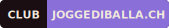
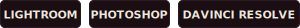
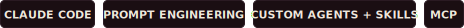
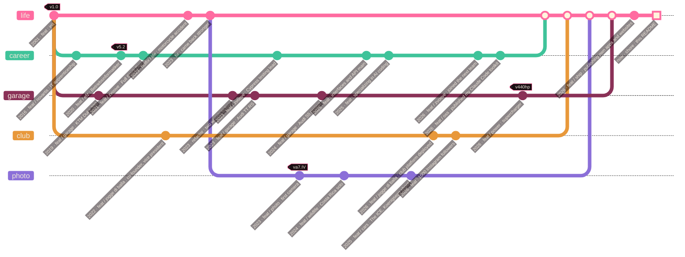

<div align="center">


<br><br>

<a href="https://manuelheller.dev"></a>&nbsp;
<a href="https://manuelheller.myportfolio.com"></a>&nbsp;
<a href="https://joggediballa.ch"></a>

</div>

<br>

> [!WARNING]
> This profile uses trailing commas,

<br>


<picture><source media="(prefers-color-scheme: light)" srcset="assets/text/h-tech-stack-light.svg" /></picture>

<div align="center">

<picture><source media="(prefers-color-scheme: light)" srcset="assets/text/t-daily-driver-light.svg" /></picture><br>
<br>

<br><br>
<picture><source media="(prefers-color-scheme: light)" srcset="assets/text/t-vibecoded-light.svg" /></picture><br>

<br><br>
<picture><source media="(prefers-color-scheme: light)" srcset="assets/text/t-creative-light.svg" /></picture><br>

<br><br>
<picture><source media="(prefers-color-scheme: light)" srcset="assets/text/t-ai-workflow-light.svg" /></picture><br>


</div>

<br>


<picture><source media="(prefers-color-scheme: light)" srcset="assets/text/h-projects-light.svg" /></picture>

<div align="center">

| &nbsp; | Project | Description | Stack |
|:---:|---|---|---|
| 🎨 | [**manuelheller.dev**](https://manuelheller.dev) | Creative developer portfolio: WebGL fluid simulation, Risograph aesthetics, GLSL shaders |    |
| 📷 | [**photography**](https://manuelheller.myportfolio.com) | Wildlife, cars and events: Costa Rica, Thailand, The ICE St. Moritz |   |
| 🎯 | [**joggediballa.ch**](https://joggediballa.ch) | Club platform: events, members, permissions, sponsors, live Twitch overlay |     |
| 🥃 | [**shot-counter**](https://github.com/manu-brighter/shot-counter) | Party scoreboard: live SSE sync, QR join by phone, desktop app |     |
| 🤖 | [**claude-code-kit**](https://github.com/manu-brighter/claude-code-kit) | Claude Code plugin marketplace: 5 workflow skills (autonomous multi-agent codebase overhaul, docs and i18n sync, publishing prep) and 5 specialist agents for GPU-heavy frontends |    |

<br>

<a href="https://github.com/manu-brighter/shot-counter/releases/latest"></a>

</div>

<br>


<picture><source media="(prefers-color-scheme: light)" srcset="assets/text/h-life-versioned-light.svg" /></picture>

<picture><source media="(prefers-color-scheme: light)" srcset="assets/text/l-changelog-light.svg" /></picture>



<br>


<picture><source media="(prefers-color-scheme: light)" srcset="assets/text/h-github-stats-light.svg" /></picture>

<div align="center">

<picture>
  <source media="(prefers-color-scheme: dark)" srcset="https://streak-stats.demolab.com?user=manu-brighter&theme=transparent&hide_border=true&ring=B89AFF&fire=FF6BA0&currStreakLabel=B89AFF&sideLabels=B9A99E&currStreakNum=F0E8DC&sideNums=F0E8DC&dates=B9A99E" />
  <source media="(prefers-color-scheme: light)" srcset="https://streak-stats.demolab.com?user=manu-brighter&theme=transparent&hide_border=true&ring=8B6FD8&fire=E0447E&currStreakLabel=8B6FD8&sideLabels=8A7A72&currStreakNum=1A0E12&sideNums=1A0E12&dates=8A7A72" />
  
</picture>

<br><br>


</div>

<br>


<picture><source media="(prefers-color-scheme: light)" srcset="assets/text/h-contributions-light.svg" /></picture>

<div align="center">

<picture>
  <source media="(prefers-color-scheme: dark)" srcset="https://raw.githubusercontent.com/manu-brighter/manu-brighter/output/github-snake-dark.svg" />
  <source media="(prefers-color-scheme: light)" srcset="https://raw.githubusercontent.com/manu-brighter/manu-brighter/output/github-snake.svg" />
  
</picture>

<picture><source media="(prefers-color-scheme: light)" srcset="assets/text/l-snake-light.svg" /></picture>

</div>

<br>

<details>
<summary><code>$ cat /etc/manuel.conf</code></summary>

<br>

```ini
[defaults]
coffee              = true
trailing_commas     = always,
deploy_time         = 09:00 ; sharp
works_on_my_machine = guaranteed

[fallbacks]
css_broken          = clear_cache_first
prod_broken         = it_was_dns
motivation_low      = drive_the_s5

[do_not_touch]
legacy_encoding     = ISO-8859-1 ; it bites
```

</details>


