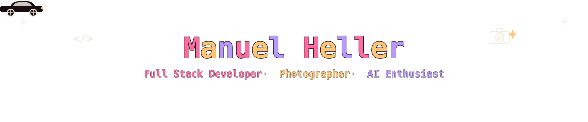

  

&nbsp;
&nbsp;

## Software for work, a club and a few creative ideas

I'm Manuel, a full-stack developer based in Switzerland. Since November 2021, I've worked at **zvoove Switzerland**, building business applications with **PHP, Vue.js and SQL**. My work spans frontend features, APIs, data exchange and release testing.

Outside work, I build and maintain applications for my club and explore interactive design. I use AI coding tools extensively in these projects, including work with React and TypeScript. My professional foundation is PHP and Vue; I'm continuing to deepen my hands-on knowledge of the newer stack.

**Available from 1 December 2026** for a full-time development role in Basel, Aargau or Zurich, with hybrid working. I'm particularly interested in teams that use AI thoughtfully in development or build AI-enabled products.

## What I work on

- **Applications and interfaces:** designed and implemented numerous Vue interfaces for complex zvoove Core features, alongside PHP backend-for-frontend endpoints, API integrations and SQL data processing. Shared responsibility for maintaining interfaces and data synchronisation.
- **Release quality:** wrote and maintained much of a Cypress suite with around 30 substantial release tests, ran the tests and investigated failures. A migration to Playwright is in progress; regular release use is still ahead.
- **Data migration tooling:** co-developed a CSV export that maps data from multiple databases to another product's import format, including validation and fixes for large or incomplete datasets.
- **AI integration:** contributed technical reviews and API extensions for an AI-enabled assistant, focusing on API contracts, tests and error handling.

<picture><source media="(prefers-color-scheme: light)" srcset="assets/text/h-projects-light.svg" /></picture>

### [Jogge di Balla](https://github.com/manu-brighter/joggediballa-mainpage) · Club and event platform

An application I developed over several months and continue to maintain for a club where I am vice president. Its features are regularly used for both administration and events.

- Role-based permissions, supporter memberships, payment status, attendance and reporting.
- An ordering and till system with separate service, kitchen and bar workflows, plus media management, a moderated live slideshow and a streaming scoreboard.
- Responsibility from the initial concept through ongoing development and operation. I set up and administer the rented Linux root server myself, including nginx configuration.

**React · TypeScript · tRPC · Drizzle · MySQL** · [Visit the site](https://joggediballa.ch)

### [manuelheller.dev](https://github.com/manu-brighter/manus-portfolio) · Interactive portfolio

My second large personal project combines development, photography and visual design: interactive WebGL fluid effects, GLSL shaders, scroll animation and several visual themes. It includes configurable quality levels and a static fallback. Making the experience smoother on less powerful devices remains an area of ongoing work.

**Next.js · React · TypeScript · WebGL · GSAP** · [Explore the portfolio](https://manuelheller.dev)

### [claude-code-kit](https://github.com/manu-brighter/claude-code-kit) · Development workflows

Reusable Claude Code skills and agents for tasks such as project reviews, documentation updates and publishing preparation. This is where I turn patterns from my own AI-assisted development into reusable tools.

### [mercurius-quant-bot](https://github.com/manu-brighter/mercurius-quant-bot) · Completed research experiment

A Python research and backtesting project. The documented hypotheses did not hold up under validation, so I ended the experiment. A useful example of testing an idea and accepting a negative result.

<picture><source media="(prefers-color-scheme: light)" srcset="assets/text/h-tech-stack-light.svg" /></picture>

**Professional focus:** PHP, Vue.js, JavaScript, HTML/CSS, MySQL/MariaDB, Cypress, REST APIs, OpenAPI/Swagger. Currently migrating release tests to Playwright.

**Personal projects:** React, TypeScript, Next.js and tRPC with AI coding support; Linux server administration and nginx. Docker and Git are part of my workflow.

**Beyond code:** photography, visual design and video editing with Lightroom, Photoshop and DaVinci Resolve. [Photography portfolio](https://manuelheller.myportfolio.com).

> This profile uses trailing commas,

Contribution graph

 

Professional work lives in GitLab, so this graph only tells part of the story.

