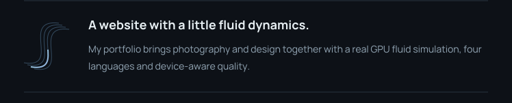
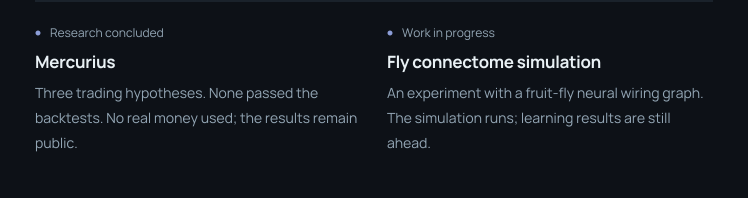

<picture>
  <source media="(max-width: 600px)" srcset="assets/manual-mode/hero-mobile.svg" />
  
</picture>

I build **PHP & Vue applications at zvoove**. After hours, I turn ideas into tools people actually use, chase good light with a camera, and spend probably too much time thinking about cars.

[Portfolio](https://manuelheller.dev) · [Photography](https://manuelheller.myportfolio.com) · [Jogge di Balla](https://joggediballa.ch)

<a href="https://github.com/manu-brighter/joggediballa-mainpage">
  <picture>
    <source media="(max-width: 600px)" srcset="assets/manual-mode/club-mobile.svg" />
    
  </picture>
</a>

<picture>
  <source media="(max-width: 600px)" srcset="assets/manual-mode/projects-mobile.svg" />
  
</picture>

[Shot Counter](https://github.com/manu-brighter/shot-counter) · [Download Shot Counter](https://github.com/manu-brighter/shot-counter/releases/latest) · [Claude Code Kit](https://github.com/manu-brighter/claude-code-kit)

<a href="https://manuelheller.dev">
  <picture>
    <source media="(max-width: 600px)" srcset="assets/manual-mode/portfolio-mobile.svg" />
    
  </picture>
</a>

<picture>
  <source media="(max-width: 600px)" srcset="assets/manual-mode/stack-mobile.svg" />
  
</picture>

<picture>
  <source media="(max-width: 600px)" srcset="assets/manual-mode/experiments-mobile.svg" />
  
</picture>

[Mercurius](https://github.com/manu-brighter/mercurius-quant-bot) · [Fly connectome simulation](https://github.com/manu-brighter/fly-connectome-sim)

<picture>
  <source media="(max-width: 600px)" srcset="assets/manual-mode/garage-mobile.svg" />
  
</picture>

<picture>
  <source media="(max-width: 600px)" srcset="assets/manual-mode/history-mobile.svg" />
  
</picture>

<details>
<summary>A few personal defaults</summary>

```ini
[defaults]
trailing_commas = always,
curiosity = enabled
outside_the_editor = camera_or_s5

[handle_with_care]
legacy_encoding = ISO-8859-1
```

</details>

<picture>
  <source media="(max-width: 600px)" srcset="assets/manual-mode/footer-mobile.svg" />
  
</picture>
